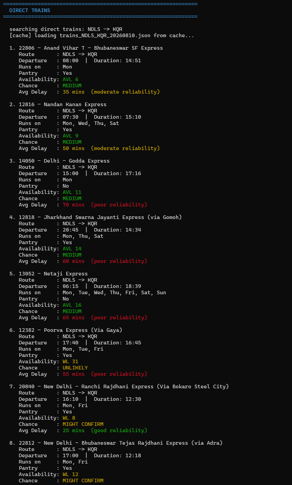
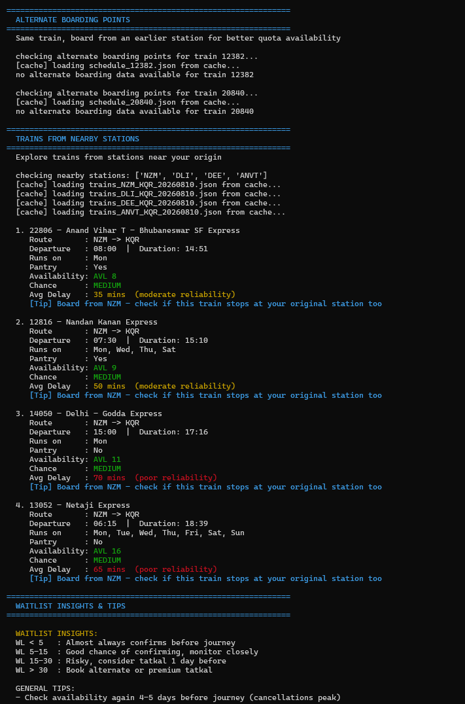

# Smart Train Route Advisor

A Python command-line tool that helps Indian railway passengers find the best train booking options when direct IRCTC tickets are unavailable or heavily waitlisted.

## The Problem

Booking train tickets on IRCTC for popular routes (like NDLS → KQR) is frustrating:
- Tickets on faster trains get waitlisted weeks in advance
- Most passengers don't know about alternate boarding points on the same train
- Nearby origin stations often have better availability for the same train
- No single tool shows all these options together

## What This Tool Does

Given your origin, destination, date and travel class, the tool:

1. **Finds all direct trains** on your route with real-time seat availability and confirmation probability
2. **Suggests alternate boarding points** — board the same train from an earlier station where quota availability is better (IRCTC allows boarding point changes)
3. **Searches nearby origin stations** — finds trains from stations near your origin that may have better availability
4. **Shows waitlist insights** — estimates confirmation chances based on WL number and provides actionable tips
5. **Shows train reliability** — average delay data so you can pick not just available but reliable trains

## Tech Stack

- **Python 3.x**
- **Requests** — for API calls to Indian Railways data
- **Colorama** — for color-coded terminal output
- **Indian Railways API** (RapidAPI) — real train data
- **Local JSON caching** — saves API responses to avoid repeated calls

## Project Structure

```
smart-train-route-advisor/
│
├── main.py         # Entry point, user input handling
├── api.py          # API calls + local caching system
├── search.py       # Core logic — train search, nearby stations, sorting
├── display.py      # Color-coded terminal output formatting
├── mock_data.py    # Seat availability data + train delay information
└── README.md
```

## Key Concepts Used

- **Graph-based station network** — nearby stations stored as adjacency list for alternate route discovery
- **Greedy sorting** — results ranked by availability, waitlist number and average delay
- **API caching** — JSON responses cached locally, first run fetches live data, subsequent runs are instant
- **Heuristic waitlist estimation** — WL confirmation probability based on IRCTC booking patterns

## Setup & Usage

**Install dependencies:**
```
pip install requests colorama
```

**Add your RapidAPI key in `api.py`:**
```python
API_KEY = "your_key_here"
```
Get a free key at: https://rapidapi.com/IRCTCAPI/api/irctc1

**Run:**
```
python main.py
```

**Example input:**
```
From Station Code : NDLS
To Station Code   : KQR
Date (YYYYMMDD)   : 20260810
Travel Class      : 2A
```

## Sample Output

```
==============================================================
  DIRECT TRAINS
==============================================================

  1. 20840 - New Delhi - Ranchi Rajdhani Express
     Route       : NDLS -> KQR
     Departure   : 16:10  |  Duration: 12:30
     Runs on     : Mon, Fri
     Availability: WL 8
     Chance      : MIGHT CONFIRM
     Avg Delay   : 25 mins  (good reliability)

  2. 12818 - Jharkhand Swarna Jayanti Express
     Route       : NDLS -> KQR
     Departure   : 20:45  |  Duration: 14:34
     Availability: AVL 14
     Chance      : MEDIUM
     Avg Delay   : 60 mins  (poor reliability)
```
## Sample Output



## Roadmap

- [ ] Web interface (Flask/Django)
- [ ] Telegram bot integration
- [ ] Live seat availability via upgraded API
- [ ] Tatkal availability checker
- [ ] PNR status tracker
- [ ] Email/SMS alerts when waitlist clears

## Why I Built This

I travel frequently between New Delhi and Koderma (Jharkhand) and consistently struggle to find confirmed tickets on this route. Most passengers are unaware that boarding point changes and nearby station searches can significantly improve their chances. This tool automates that entire process.

---

*Note: Seat availability data is currently served from a structured mock dataset modeled on real IRCTC patterns for the NDLS-KQR route. The API integration layer is fully built and ready for a live data source — upgrading requires changing one function in `api.py`.*
